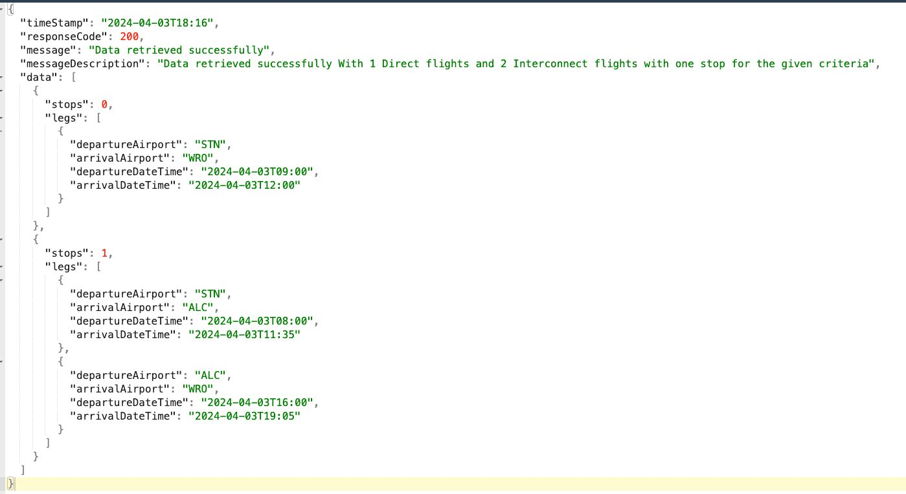

# ryanair-flight-search-service
Spring Boot based Reactive RESTful API application which serves information about possible direct and interconnected flights (maximum 1 stop) based on the data consumed from external APIs.
# Tech Stack
Java 21 , SpringBoot 3.0.7 , WebFlux , Docker

# Instracutions and Notes

Application can access using thi surl -> http://localhost:8080/api/v1/flight/interconnections?departure=DUB&arrival=WRO&departureDateTime=2024-04-03T07:00&arrivalDateTime=2024-04-03T20:26

> Note: I have made the final response more readbale and generic as follows while maintaing the requetsted response form (requested request form is under `data` section

